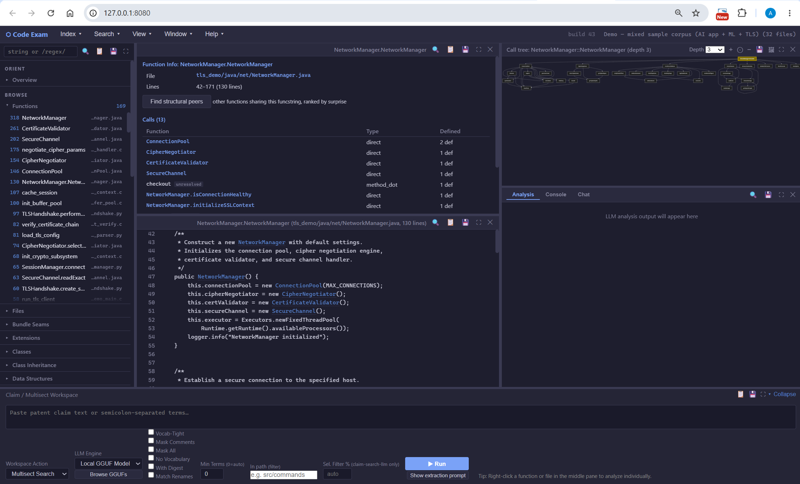

# The CodeExam GUI

`node src/server.js --port 3000` (or just `ce --gui`) opens CodeExam's multi-pane interface in
your browser. It is called the **GUI** rather than a "web UI" on purpose: it binds **127.0.0.1**
only, makes no outbound network calls of its own, and simply happens to render in a local browser —
nothing about it is web-facing. Launch, the loopback-only posture, and the demo index are covered
in [`GETTING_STARTED.md`](GETTING_STARTED.md); this page describes what the interface does.

*The GUI on the bundled demo index: the menu bar on top; left-pane catalogs; the middle output and
source panes; a diagram pane and the tabbed Analysis / Console / Chat pane on the right; and the
Claim / Multisect Workspace across the bottom. (September 2026.)*

## The layout

The GUI is organized into a menu bar and several panes:

- **Menu bar** (top) — the **Index**, **Search**, **View**, **Window**, and **Help** dropdowns,
  with the build number and a summary of the loaded index on the right. The menus open the main
  dialogs and options: **Index** → **Load Index** and **Build Index** (and lists the indexes it
  finds); **Search** → the search dialog and its match options; **View** and **Window** → which
  panes are shown and how they're arranged (including pop-outs, and **View → Exclude Tests**);
  **Help** → the README and the guided tour. The GGUF-model browser (for choosing a local model)
  is reachable from the Workspace and the menus.
- **Left pane** — a search box plus the catalogs you browse the codebase through (detailed below).
- **Middle column** — two stacked panes. The **upper** pane shows a command's output: search
  results, a function's info and its calls, a digest, or a catalog. The **lower** pane is the
  **source viewer**. Selecting a row in the upper pane typically opens the corresponding source (or
  expands a collapsed/deduped result row) in the lower pane.
- **Right column** — two stacked panes. The **upper** pane draws **diagrams** — call trees and
  file-coupling / relationship views — with a depth control, zoom, and image export. The **lower**
  pane is tabbed: **Analysis** (LLM analysis output), **Console** (the interactive REPL), and
  **Chat** (LLM chat over the tools).
- **The Claim / Multisect Workspace** (bottom, full-width, collapsible) — paste a patent claim or a
  list of semicolon-separated terms, pick a **Workspace Action** (e.g. Multisect Search), set the
  options (mask comments, mask all, vocabulary, digest, minimum terms, a path filter), choose the
  **LLM engine** (a cloud model or a local GGUF), and **Run**. This is the GUI entry point to the
  multisect / claim-search workflow described in [`AI_ASSISTED_CODE_EXAM.md`](AI_ASSISTED_CODE_EXAM.md);
  **Show extraction prompt** prints the prompt without calling a model.

**Common pane controls.** Every pane's header carries the same set of controls: **find in pane**,
**copy to clipboard**, **save to file**, **pop out / enlarge**, and close.

**Right-click** a function or file — in the left pane or the middle pane — for a context menu of
actions on that item: extract, digest, callers, analyze. (The Analyze action uses whichever LLM
engine is currently selected, so what it offers tracks your engine choice.)

The exact pane geometry is deliberately in flux: CodeExam is moving away from a fixed layout toward
a design where many features behave as semi-independent mini-apps — so that, for example, several
instances of a feature can run side by side for comparison, and long-running operations proceed on
their own threads. That redesign, and the open questions behind it, are tracked in
[#38](https://github.com/aschulman42-cell/code-exam/issues/38).

## The left pane: browse, catalogs, and duplicates

The left pane is where you orient yourself in an unfamiliar codebase. Under an **Orient** heading
sits **Overview** (the one-shot "what is this codebase" summary); under **Browse** sit the
structural lists — **Functions**, **Files**, **Classes**, **Class Inheritance**, **Data
Structures**, plus **Bundle Seams** and the extension census. Clicking a row loads it into the
middle panes.

Below those are the cross-cutting **catalogs and detectors** that summarize a whole codebase at
once: the **AI/ML** inventory (models, kernels, training, inference, pipelines, …), the
**client/server** HTTP surface, **referenced resources** (URLs, env vars, paths, external commands,
model IDs), the **command catalog** (the target's own user-facing commands), telemetry
**breadcrumbs**, **imports / BoM**, and **prompts** — each row linking to its `file:line` sites —
and the **duplicate** families (exact, near, structural, and fingerprint; see
[`STRUCTURAL_SEARCH.md`](STRUCTURAL_SEARCH.md)).

The left pane also carries the code **metrics** — hotspots, entry points, complexity — but these
are one signal among many; the browse and catalog surfaces are usually the more useful starting
point on a codebase you don't know. A **filter box** narrows any list.

## Following the code

Once a symbol is in front of you, the GUI mirrors the CLI's cross-reference commands:

- **Callers / callees** — who calls this function, and what it calls. In the upper-middle pane a
  function's **Calls** table lists each call with its type and how many definitions match; each
  entry is clickable.
- **Diagrams** — the transitive call tree and file-coupling / relationship views render in the
  upper-right pane, with a depth control, zoom, and image (SVG/PNG) export.
- **The source viewer** makes call sites **clickable**: click a call to jump straight to the
  callee's source, and step back out with the pane's back (**‹**) arrow.

*[[placeholder: replace with a current view.]] A file-map diagram (April 2026 — out of date).*

## Chat

The GUI's **Chat** tab lets an LLM drive CodeExam's own tools to answer free-form questions about
the loaded index. A cloud model (Claude / ChatGPT / Gemini) is generally the stronger chat engine;
a local GGUF model works too, within limits. What each local model can and can't do in Chat is
measured per model in [`docs/model-support.md`](docs/model-support.md) — Gemma3-12B, for example,
is rated **DEGRADED**: it navigates and calls tools correctly but sometimes needs to be told to
fetch a function body. The tool surface Chat drives is documented in
[`CODEEXAM_MCP.md`](CODEEXAM_MCP.md).

## Everything the CLI can do

The GUI and the CLI share one engine and one index format, so most GUI actions have a CLI
equivalent — and the **Console** tab is an in-GUI REPL that runs CLI commands directly against the
loaded index, so you never have to leave the window to drop to a command. The full command
reference is in [`CODEEXAM_CLI.md`](CODEEXAM_CLI.md).

The correspondence isn't always pixel-for-pixel: a few things the GUI draws as diagrams the CLI
produces as **text** carrying the same information (e.g. `--file-map` prints a textual map rather
than an image). Index management — Load Index, Build Index, and the GGUF-model browser — lives in
the menu bar (see **The layout** above); the on-disk index format and multi-index behavior are in
[`CODEEXAM_INDEXES.md`](CODEEXAM_INDEXES.md).

## Symbols & notation

CodeExam's lists and digests use a few compact markers — `~` (heuristic), `[lib?]`, the `×N`
counts, the instance-vs-row counts (the accordion badge), `?`, and the test/example and unresolved
indicators. They're shared across the GUI and the CLI, so the full reference — what each means, with
a concrete example on each surface — is in its own doc: [`CODEEXAM_NOTATION.md`](CODEEXAM_NOTATION.md).

## Related

- [`GETTING_STARTED.md`](GETTING_STARTED.md) — launching the GUI and the loopback-only posture.
- [`CODEEXAM_CLI.md`](CODEEXAM_CLI.md) — the command line the GUI mirrors (and the Console runs).
- [`CODEEXAM_NOTATION.md`](CODEEXAM_NOTATION.md) — the `~` / `[lib?]` / `×N` markers, shared with the CLI.
- [`AI_ASSISTED_CODE_EXAM.md`](AI_ASSISTED_CODE_EXAM.md) — the analyze / multisect / claim workflow
  the Workspace drives.
- [`CODEEXAM_MCP.md`](CODEEXAM_MCP.md) — the tool surface the Chat tab drives.
- [`CODEEXAM_INDEXES.md`](CODEEXAM_INDEXES.md) — building, loading, and managing the index the GUI
  reads.
