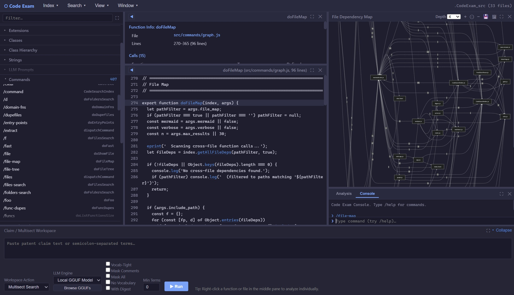

# CodeExam

CodeExam, as its name implies, is a tool for **examining code** — primarily
source code, but with a growing emphasis on **quasi-source**: recovering
indexable structure from artifacts that weren't shipped as source (minified
bundles, executables, embedded scripts). It runs as both a **GUI** and a
**CLI** (plus an interactive REPL and an MCP server), all over one shared
index.

At its core, CodeExam is language-broad: build an index over a codebase,
then browse, full-text/regex/inverted-index search, and cross-reference
(callers, callees, call trees, file/folder coupling) at scale — across **C,
C++, Java, JavaScript, TypeScript, Python, C#, Go, Rust, PHP, and Ruby**
(tree-sitter), with regex-level support for a dozen more. If you've used a
code-comprehension tool like SciTools Understand, the browse-and-cross-
reference surface will feel familiar.

What CodeExam emphasizes beyond that baseline:

- **Quasi-source recovery** — index minified/bundled JS, binaries (strings +
  demangled C++ symbols), and JavaScript extracted from native install
  executables, then search and cross-reference them with the same machinery
  as real source.
- **Deobfuscation and fingerprinting** — infer readable names for obfuscated
  code (on by default; toggle off with `--no-rename`), and — work in progress —
  match a bundled function back to its source-library equivalent via
  transform-resilient "funcstrings" and portable fingerprint files.
- **Multisect** — find the smallest scope (function / class / file) that
  contains substantially all of N terms, and parse prose (a patent claim, a
  spec, a bug report) directly into such a query.
- **Catalogs** — extract a codebase's CLI commands, LLM prompts, and
  telemetry breadcrumbs, each linked back to its handler.
- **Optional LLM assistance**, including an **air-gapped** local-GGUF mode for
  code that must not be exposed in any way outside a protected computer.

A growing focus is **examining AI-related software**, and much of that is now in
place. CodeExam ships a dedicated **AI/ML and LLM-app detectors** suite (see
Feature highlights below) that surfaces inferred pipelines, the models a codebase
defines and uses, LLM calls, tools, agents/chains, embeddings, and more —
alongside LLM prompt extraction, stress-tested on large AI codebases such as
Claude Code's minified `cli.js` (≈14 MB, bundled with `claude.exe`) and Codex's
Rust source. It indexes the major ML framework and model trees (PyTorch, Hugging
Face Transformers, scikit-learn; model repos such as DeepSeek, Qwen, Llama) with
the same general machinery. This remains an area of active development.

CodeExam is ~47,000 lines of JavaScript (engine + CLI + GUI) running under
Node.js, developed in close collaboration with Claude Code: nearly all of the
code was written by Claude Code, in several important places building on the
main author's earlier tooling (e.g. "Opstrings" and function digests, the
"NiceDbg" debugger, and an `ndx`/`find` inverted-index search tool).

## Four ways to use it

- **CLI** — `node src/index.js <command>` for one-shot queries and scripting.
  Run `node src/index.js --help` for the full command list.
- **Interactive REPL** — `node src/index.js --interactive`, then issue slash
  commands (`/fast`, `/extract`, `/file-map`, `/help`, …). The same REPL is
  also reachable from the GUI's Console pane; a few commands (`/file-map`
  etc.) are currently REPL-only.
- **GUI** — `node src/server.js --port 3000` opens a multi-pane interface
  served from **localhost only** (no remote access, no outbound network
  calls). Called "GUI" rather than "browser UI" because nothing about it is
  web-facing — it just happens to render in a local browser. Left pane:
  function/file/class accordions and other catalogs. Middle-top: output.
  Middle-bottom: source viewer with linkified call sites. A **Workspace**
  area collects what you're actively examining. Mermaid call trees and
  file-coupling diagrams render inline. The GUI is gradually moving toward a
  newer design with less of a fixed three-pane layout (the goal being that many
  features operate as semi-independent mini-apps — so that, for example,
  multiple instances of a feature can run side-by-side for comparison, and
  long-running operations proceed on their own threads).
- **MCP server** — `node src/mcp-server.js` exposes the indexed codebase as
  Model Context Protocol tools, so Claude Code or Claude Desktop (and
  presumably other MCP clients such as Codex, though that's untested) can
  search, extract, and analyze it directly.

All four share the same `CodeSearchIndex` engine and the same on-disk index
format. Build the index once; query from any of them.

A **standalone `codeexam.exe`** (see below) is not a fifth mode — it's the same
CLI and GUI packaged so they run without a Node install.

## Quick start

```bash
# Build an index over a codebase (handles directories, zip/tar archives,
# binary files, minified JS, and @filelist files)
node src/index.js --build-index /path/to/codebase

# Launch the GUI (localhost only)
node src/server.js --index-path .code_search_index --port 3000
# then open http://localhost:3000
```


*Prompt catalog — LLM prompts recovered from the minified `cli.js` bundled inside `claude.exe`.*



*File-map view (April 2026 — slightly out of date, but representative).*

Indexes scale to multi-gigabyte source trees (tested on Chromium — ~195K
files, ~5 GB index, loaded with `NODE_OPTIONS=--max-old-space-size=8192`).

## Feature highlights

### Browse and search
- Function/file/class accordions; full-text, regex, and inverted-index
  (`--fast`) search.
- **Multisect**: find the smallest scope — function, class, or file —
  containing substantially all of N search terms. Each term can be
  hard-required, negated (`!term` / `NOT term`), or **soft** (`?term` —
  optional: it does not gate the result set but still boosts ranking). Prose
  — a patent claim, a design spec, a bug report — can be parsed directly into
  a multisect expression (`--claim-search`).
- **Cross-reference**: callers, callees, transitive call trees, file and
  folder coupling maps. Mermaid diagrams for call trees and coupling maps;
  individual caller/callee lists are tabular.
- **Function / class / file digests** — concise per-target summary (identity,
  callers, callees, distinctive strings, structural shape, inheritance chain +
  known subclasses for classes, imports/exports for files) usable standalone
  or as input to LLM prompts. Class digests walk the ancestor chain and
  surface known subclasses with method-override counts. (Reliable
  class-hierarchy tracking in static examination — especially for C++ — is
  still being hardened; see #65 and #60.)

### Metrics and code-surfacing

Where to start looking in an unfamiliar codebase. These are useful today but
under active refinement — some (notably hotspots and gaps) are still being
tuned toward their intended sharpness.

- **Hotspots / class hotspots / most-called** — complexity- and
  centrality-ranked functions and classes.
- **Domain-function ranking** and **entry points** — the functions most
  characteristic of, or at the edges of, the codebase.
- **Dead-code gaps** — references that don't resolve to indexed source,
  declared dependencies, or the standard library.
- **Vocabulary / nomenclature discovery** — the project-specific terms a
  codebase centers on, surfaced by cross-document TF-IDF (with a
  per-function fallback for single-file / bundled corpora).

### Catalogs of "what does this code do" / "where should I start reading"

- **Command catalog** — detected CLI options, slash-commands, and (where
  recognizable) menu items and dialog actions in the target codebase, linked
  to handler functions or methods (so a `/skills` entry in a chat tool
  resolves to its actual handler in the source). Heuristic — some shapes
  (e.g., chained Commander.js declarations) are still under-detected.
- **Breadcrumbs** — telemetry markers (logging, analytics, audit calls) with
  their associated functions, useful for tracing what an obfuscated binary
  actually reports back.
- **AI/ML and LLM-app code** — extensive catalogs of the AI/ML and LLM-app
  constructs in a codebase (models, LLM calls, tools, chains, prompts, and
  more) — see *AI/ML and LLM-app detectors* below.
- **Vocabulary** — TF-IDF-ranked domain-specific terms and nomenclature,
  surfacing what a codebase is "about" (`--vocabulary` / `--vocab`).
- **Metrics** — code-surfacing rankings (hotspots, complexity, most-called,
  domain-specific functions) for finding where to start reading.

### Deobfuscation, renames, and fingerprints
- Detects esbuild / minified JS and prettifies via `js-beautify`.
- Optional `webcrack` for bundle disassembly (≤500 KB files).
- Auto-infers readable names from obfuscated code (toggle off with
  `--no-rename`):
  - `_KW_` keyword inference from string literals
  - `_NAME_` recovery from `__name(fn, "originalName")` esbuild helpers
  - `_IMPORT_` resolution from import bindings
  - `_CMD_` recovery for command/route/skill handler functions
- **Funcstrings** — a distinctive-string + call signature per function.
  Resilient to esbuild/webpack transforms. The goal is to match a bundled
  `cli.js` function back to its source-library equivalent; this works in
  controlled cases (see the `franken.fp.json` example below) but reliably
  identifying generic library code — e.g. C-runtime functions like `fopen` /
  `printf` in a stripped binary — is still in progress. Two access shapes: full
  funcstring (`--show-funcstring`) for human inspection, and funcstring
  hashes (`--funcstr-hashes`) for cross-index intersection.
- **Portable fingerprint files** (`*.fp.json`) — fingerprint a curated
  reference library once, then match the resulting `.fp.json` against any
  working index without redistributing the library's source. Generate with
  `--build-fp-renames`; the working example shipped today is
  `franken.fp.json`. Matches surface as `_FP_`-prefixed names.
- Multiple types of duplication detection: exact (SHA1), near-duplicate, and
  **structural-dupe** (AST-shape hashing for non-bundled code). Dupes are
  preserved, not collapsed.

The reason CodeExam spends so much machinery on duplicate detection is not the
obvious one (avoiding re-analysis): it's the inverse use. The same signatures
that find duplicates are what let you identify *unknown* code by matching it
against known reference code, and trace function lineages — three near-dupes
evolved from a common ancestor — across versions or forks.

The richness here is that there are *complementary* signature types, and
deliberately so, because each survives a different kind of transformation:

- **Structural / near-dupe signatures** (AST-shape and near-duplicate hashing)
  are *naming-independent* — they still match after a rename pass or
  minification has mangled every identifier, because they key on the *shape* of
  the code, not its names.
- **Funcstrings** are a *naming-dependent, extrinsic* signature — distinctive
  string literals plus the external API calls a function makes. They key on what
  the code *says and calls* rather than its shape, and survive the inverse
  transformation: restructured control flow whose strings and call targets are
  unchanged.
- **LLM analysis** (`--analyze`) is the higher-cost adjudicator for the hard
  cases neither structural nor extrinsic signatures resolve on their own,
  reasoning about the code in context.

No single signature is sufficient on its own; used together — structural,
extrinsic, and (for the residual hard cases) LLM-assisted — they identify
unknown code far more reliably than any one of them.

### AI/ML and LLM-app detectors

A group of heuristic detectors that surface the AI/ML and LLM-app constructs in
a codebase — available both as a left-pane **AI/ML** section in the GUI and as
matching CLI flags (`--pipelines`, `--models-used`, `--llm-calls`, …; each has a
`--list-<name>` alias). They span classic ML (PyTorch / HF Transformers /
scikit-learn) and LLM-application code (SDK calls, tools, agent/chain
frameworks). Detection is pattern-based — it favors recall and is honest about
its misses, and distinct names are kept rather than over-collapsed.

Three views lead:

- **AI/ML Pipelines (inferred)** — the connected-flow overview. CodeExam infers
  end-to-end pipelines (RAG, training, inference, agent, LLM-app) from the
  *co-occurrence* of the component cells below, so you see how the pieces wire
  together instead of a flat list. The best lead-in to an unfamiliar AI codebase.
- **Models Used** — the named models actually loaded or called across the whole
  codebase, deduped and labeled api-vs-local (an API id like `gpt-4o`, a `.gguf`
  path, a Hugging Face repo id). Distinct from **Models (defined)** below, which
  lists model *classes* (`nn.Module` / Keras / scikit-learn subclasses).
- **Prompts** — the prompt catalog (relocated here from *Catalogs*): detected
  LLM prompts, with composite expansion — ternary branches, `${var}` templates,
  and `[…].join(…)` assemblies merged into one searchable entry per logical
  prompt. Detects inline strings, `getSystemPrompt` / `systemPrompt:`,
  `role:"system"` messages, and `.md` skill files.

The component detectors the Pipelines view synthesizes from — each also a
standalone list (GUI accordion + CLI flag):

- **LLM Calls** — SDK calls / endpoints (`messages.create`, `ChatOpenAI`, `LlamaChatSession`).
- **Tools** — tool / function-calling defs and dispatch (`@tool`, `input_schema`, MCP).
- **Chains / Agents** — orchestration via LangChain / LangGraph / DSPy / CrewAI.
- **Embeddings / Vectors** — embedding and vector-search sites (FAISS / Chroma, similarity search).
- **Structured Output** — schema-constrained output (`with_structured_output`, `response_format`, parsers).
- **Inference** — local generation / prediction (`generate`, `no_grad`, `.predict`).
- **Training** — training sites (PyTorch loops, HF `Trainer`, `.fit`).
- **Datasets** — dataset definitions and loaders (`Dataset` / `IterableDataset`, `tf.data`).
- **Artifacts** — model load/save sites (`from_pretrained`, GGUF, safetensors) and quantization configs (BitsAndBytes / GPTQ / AWQ, 4-/8-bit).
- **Models (defined)** — model classes by inheritance (`nn.Module` / Keras / scikit-learn).
- **Kernels** — GPU kernels (CUDA `__global__`, Triton `@triton.jit`, numba).
- **Multimodal / Vision** — vision encoders (CLIP/ViT), CNN architectures (ResNet/conv), object detection/segmentation (YOLO/SSD/DETR/U-Net), generative (diffusion/VAE).
- **Post-training / Fine-tuning** — fine-tuning & alignment mechanisms (LoRA/PEFT/adapters, SFT/DPO/PPO/GRPO, distillation), distinct from pretraining.
- **Reasoning / CoT** — chain-of-thought and reflection *prompt language* (`step by step`, `chain-of-thought`, reflection/scratchpad). A heuristic signal over prompt text, not a structural-reasoning detector.

### Quasi-Source: recovering structure from non-source artifacts

The thesis tying several features together: a surprising amount of useful
structure can be recovered from things that weren't shipped as source, then
indexed, searched, and cross-referenced with the same machinery as real
source. The minified-JS deobfuscation and fingerprinting above are part of
this spirit; the two surfaces below extend it to compiled and packaged
artifacts. (Tracked as an umbrella in issue #76.)

**Binary-code analysis**

- Indexes binary files (executables, libraries) inside source trees by
  extracting strings AND demangled C++ function signatures (Itanium and MSVC
  name mangling).
- Granularity today: one pseudo-function per binary file, containing the
  file's extracted strings and demangled symbols. Search and the inverted
  index work on these uniformly with source content; per-function
  call/caller analysis does not apply to binary content.
- Most useful for *large* binary corpora — Windows 11 system DLLs, Microsoft
  Office plugin trees, vendor SDKs — where the per-file string-plus-symbol
  fingerprint is enough to navigate at scale.

**Binary-bundled JavaScript extraction**

- `--extract-js-from-binary <path>` recovers embedded JavaScript from native
  install binaries and writes it to a directory CodeExam can index normally.
  Format-aware dispatch: currently supports Bun standalone executables (used
  by Claude Code's `claude.exe`), including PE-signed Windows builds where the
  Bun trailer sits before the Authenticode certificate. Other formats (pkg,
  nexe, Node SEA, Tauri asset-table) are tracked as future work.

### LLM-assisted (optional)
- `--analyze <function>` — Claude (or a local GGUF model) explains a function
  in context.
- **Multisect Analyze** — runs a multisect search, then has the LLM produce a
  structured per-term verdict grid: each search term is rated `PRESENT` /
  `NAME-ONLY` / `IFFY` / `ABSENT` with supporting evidence and a confidence
  level, so you can see at a glance how each term maps onto the matched
  function.
- `--claim-search <prose>` — extracts search terms from descriptive text (a
  patent claim, a spec, a requirement), multi-sects to find matching code,
  optionally LLM-summarizes each match.
- **Input masking** — strip comments, mask string literals, mask identifier
  names before sending a function to an LLM. The primary point is to force
  the model to reason about *logic* rather than leaning on comments or naming
  heuristics — both of which can mislead, especially in obfuscated bundles
  where the names were inferred. (Masking also suppresses some incidental data
  leakage, but it's not a hard security boundary — strings may still leak
  depending on configuration.)
- `--build-prompt <function>` — generates a digest+source prompt suitable for
  hand-pasting into any LLM (no API needed). Use this to feed CodeExam
  findings to a chat tool while keeping source local.
- Offline operation via a local GGUF model under `node-llama-cpp`. Suitable
  for code review under Court Protective Order where outbound network requests
  are prohibited. Model compatibility tracks the `llama.cpp` bundled inside
  `node-llama-cpp`: older architectures load (e.g. Qwen 3), while the newest
  (Gemma 4, Qwen 3.5) currently fail with a generic load error — see issue
  #75.

A candid caveat on the local path: a local GGUF model is not as capable as a
frontier API model like Claude. CodeExam compensates by feeding local models
simpler prompts with narrower expectations, and the resulting output is often
not as good as the Claude-API path. Closing that gap is a major ongoing focus —
better hardware (a capable GPU) and/or loading larger local models should both
help.

### Index management
- Pure-Node streaming JSON parser handles 5 GB+ indexes.
- Build from directories, glob patterns, archives (zip/tar/gz), or
  `@filelist` files.
- Query several indexes in a single run with `--multi-index @indexlist`.
- Multi-language parser via tree-sitter WASM grammars + regex fallback:
  - Tree-sitter: **C, C++, Java, JavaScript, TypeScript, Python, C#, Go,
    Rust, PHP, Ruby**
  - Regex-only: **Swift, Kotlin, Scala, Lua, Objective-C, CoffeeScript,
    Perl, VBScript, AWK**

**Why a plain inverted index rather than a vector database or SQL?** Readers
coming from recent tooling often expect a vector store (ChromaDB, FAISS) or a
relational database, and assume either would be preferable to "plain text in
JSON." The choice is deliberate. Exact and regex code search wants *lexical*
precision, not nearest-neighbor approximation, so embeddings buy little for the
core browse-and-cross-reference workload. Keeping the index as inverted-index
structures serialized to JSON makes it transparent, diffable, and trivially
portable across machines — there is no database server to stand up and no
opaque binary store. Semantic / embedding search — vector similarity, and
lighter-weight options such as small specialized models for retrieval — is
something we're *exploring* as a layer *on top* of the lexical index rather than
a replacement for it (backlog: RAG-style retrieval and embedding/small-model
term extraction, TODO #201 / #202); it is not part of the core today.

## Architecture

```
CLI            Interactive       GUI server      MCP server
(index.js)    (interactive.js)  (server.js)     (mcp-server.js)
       \           |                |               /
        \          |                |              /
         CodeSearchIndex  ←  the engine
         (src/core/)
              ├── CodeSearchIndex.js     (index build, query API)
              ├── TreeSitterParser.js    (multi-language AST parsing)
              ├── rename.js              (_KW_, _CMD_, _NAME_, _IMPORT_ inference)
              ├── calls.js               (caller/callee graph)
              ├── multisect.js           (smallest-scope-containing-all-terms)
              ├── vocabulary.js          (domain-vocabulary discovery)
              ├── breadcrumbs-commands.js  (telemetry + command catalog)
              ├── hotspots.js            (complexity metrics)
              ├── canonical-funcs.js     (canonical-form normalization)
              ├── distance-helpers.js    (string + structural distance)
              ├── structural-fingerprint.js  (AST-shape hashing)
              ├── bundle-seam-detection.js   (esbuild module boundaries)
              └── CSI-helpers.js         (shared utilities)

src/commands/  (per-feature command modules invoked by the CLI / REPL /
                MCP / GUI dispatchers)
  ├── search.js, browse.js, callers.js, graph.js
  ├── metrics.js, dedup.js, multisect.js
  ├── digest.js, prompts.js, claim.js, analyze.js
  ├── fingerprint.js, build_fp_renames.js
  ├── extract_js_from_binary.js
  └── interactive.js  (REPL, used standalone and from the GUI Console)

public/  (GUI, modular ES extracts from the former monolithic app.js)
  ├── app.js              (top-level wiring)
  ├── state.js, api.js, dom-utils.js
  ├── click-handlers.js, context-menu.js
  ├── chrome — dialogs.js, overlays.js, console.js, layout.js
  ├── mermaid.js, source-viewer.js
  ├── prompts-and-catalog.js, menu-bar.js
  ├── middle-pane.js, list-renderers.js
```

## Requirements

- Node.js 18+ (ES modules, `node:test`).
- `npm install` to fetch runtime dependencies (Anthropic SDK, Express, MCP
  SDK, web-tree-sitter, js-beautify, webcrack, node-llama-cpp, Mermaid
  renderers — see `package.json`).
- Tree-sitter grammars vendored separately in `grammars/`.
- For local LLM inference: a GGUF model file. Compatibility is uneven and
  tracks the `llama.cpp` bundled in `node-llama-cpp` — older architectures
  load (e.g. Qwen 3), the newest (Gemma 4, Qwen 3.5) currently fail (#75). If
  a recent model won't load, `npm update node-llama-cpp` to pick up a newer
  bundled `llama.cpp` is the cheapest first thing to try.

## Standalone executable (Windows)

A single-file `codeexam.exe` can be built so users without Node, npm, or Bun
installed can run CodeExam directly. v0 is Windows-only (#78); macOS and Linux
builds are deferred.

Build:

```bash
npm install                  # if you haven't already
npm run build:exe            # requires Bun on the developer machine
                             #   winget install Oven-sh.Bun
```

This invokes `bun build --compile --target=bun-windows-x64` via
`scripts/build-exe.js` and writes `dist/codeexam.exe` (~100 MB — the size is
dominated by the bundled Bun runtime, not by CodeExam itself) plus two sibling
directories that must travel with the exe: `dist/grammars/` (tree-sitter
WASMs, for `--use-tree-sitter` parsing) and `dist/public/` (GUI assets, for
`--gui` mode). Ship `dist/` as a single zip.

Run:

```
codeexam.exe --build-index <source-dir>     # CLI: behaves as `node src/index.js`
codeexam.exe --gui                          # GUI: starts server + opens browser
codeexam.exe --gui --port 9000              # override default port (8080)
```

With no `--index-path`, `--gui` looks for a `.code_search_index` directory in
the current folder. If it isn't there, the GUI still comes up — just empty —
and you can point it at an index with **Load Index** from the menu, or build one
first with `--build-index`. (Shipping a small ready-to-browse sample index
alongside the exe is on the list, so a first-run GUI has something to show.)

**Windows SmartScreen** warns "Windows protected your PC" on first run of an
unsigned exe. Click *More info → Run anyway*. v0 ships unsigned; Authenticode
code signing for public distribution is a future follow-up.

**Lite build (no local-LLM):** if `bun --compile` can't bundle the
`node-llama-cpp` native module on your platform, build with
`npm run build:exe -- --no-llm`. The resulting exe runs everything except
semantic-search / local-GGUF features.

## Testing

```bash
npm test          # node --test "test/test_*.js"
```

~400 tests across the test suite, covering the indexing engine, search,
multisect, cross-reference, fingerprinting, dedup, and the LLM-assisted
command layer. The suite runs green on Windows and Unix-likes. GUI tests are
not yet automated — GUI test automation built on [XMLUI](https://www.xmlui.org/)
is under evaluation (see #73's feasibility study).

## Operating without a network

The GUI binds to localhost, the MCP server uses stdio, and outbound network
requests are opt-in and gated. Combined with the optional local-GGUF path,
CodeExam can run a full examination workflow without any network access —
appropriate for litigation, security review, or any context where source must
stay local. The one honest trade-off is capability: the local-GGUF path is less
capable than the Claude-API path (see the LLM-assisted notes above), so the
non-LLM machinery does most of the work in a fully air-gapped run and LLM output
quality is generally below what the API would produce.

## Known limitations

- **File-path lookup on Windows / mixed separators** (#67) — paths CodeExam
  *displays* (e.g. `ace\examples\test.cpp`) don't always round-trip as
  *input* to path-taking commands (`--digest`, `--show-file`, `--extract`,
  `--callers`, …). Workaround: use a bare filename, which suffix-matches
  (`--digest test.cpp`). Under investigation.
- **Local-LLM model coverage and quality** (#75) — newest GGUF architectures
  (Gemma 4, Qwen 3.5) fail to load; older ones work. Separately, local-model
  output quality lags the Claude-API path. See Requirements.
- **Command-catalog false positives** (#66) — `--command-catalog` and the
  command section of `--digest` can surface regex fragments or example
  strings as if they were commands. Being tightened.
- **GUI test automation** — not yet in place; evaluating an
  [XMLUI](https://www.xmlui.org/)-driven approach (#73).
- **Symbol lookup ambiguity across same-named classes/functions** (#85) — in
  large or mixed-language codebases, multiple classes/functions can share a bare
  name (across files, versions, even languages). `--digest` and right-click →
  Digest may merge them or mislabel the result (e.g. a Python class's digest
  titled with a same-named C++ declaration from a vendored header). The digest
  *body* is usually still correct; the *title/target* may be wrong. Better
  disambiguation — file/line-qualified targeting and conflation warnings — is
  planned.
- **AI/ML detection is heuristic** (#98, #92, #122, #135, #136) — the detectors
  favor recall: counts are *presence signals*, not exact site counts. Expect
  false positives (library types like `Eigen::Dense` flagged as models, prose
  or doc-search strings flagged as prompts, `messages.create` collisions) and
  some misses, especially in vendored/test-heavy trees. Treat the AI/ML
  accordions as leads to verify in source, not a precise inventory. Precision
  and recall are being tightened cell by cell.
- **C++ class recognition is incomplete** (#65) — the C++ parser doesn't
  reliably catch class *declarations*; many classes surface only as inferred
  from `::`-qualified usage, so class lists and class digests can be partial or
  mislabeled on C++-heavy trees. Language-aware C++ digest handling (#60, #68)
  is planned.
- **GUI lists can silently cap results** (#137) — left-pane accordions and
  some drilldowns cap the number of rows returned (e.g. a few hundred) without
  always disclosing it, so a large result set may look complete when it isn't.
  Use `--filter` to narrow, or the CLI for full output. Explicit "N of M shown"
  disclosure everywhere is planned.
- **Indexing very large or pathological files** (#88) — without per-file size
  caps / parse timeouts, `--build-index` can hang (tree-sitter) or run out of
  memory on extreme inputs; guards are planned. (The `codeexam.exe` Bun build
  also has a known `--build-index` EEXIST bug, #91 — use the Node path
  meanwhile.)

## Related: CodeClaim

A patent-focused build, tailored for IP-litigation workflows, is developed
under the name **CodeClaim**. CodeClaim shares the CodeExam engine and adds more
extensive claim-specific extraction — including the use of dependent claims and
the patent specification, and user-supplied claim-construction alternatives —
together with term-mapping and reporting such as claim charts.

---

*CodeExam and CodeClaim are developed by Andrew Schulman. For more
information, see [softwarelitigationconsulting.com](https://www.softwarelitigationconsulting.com/).*
