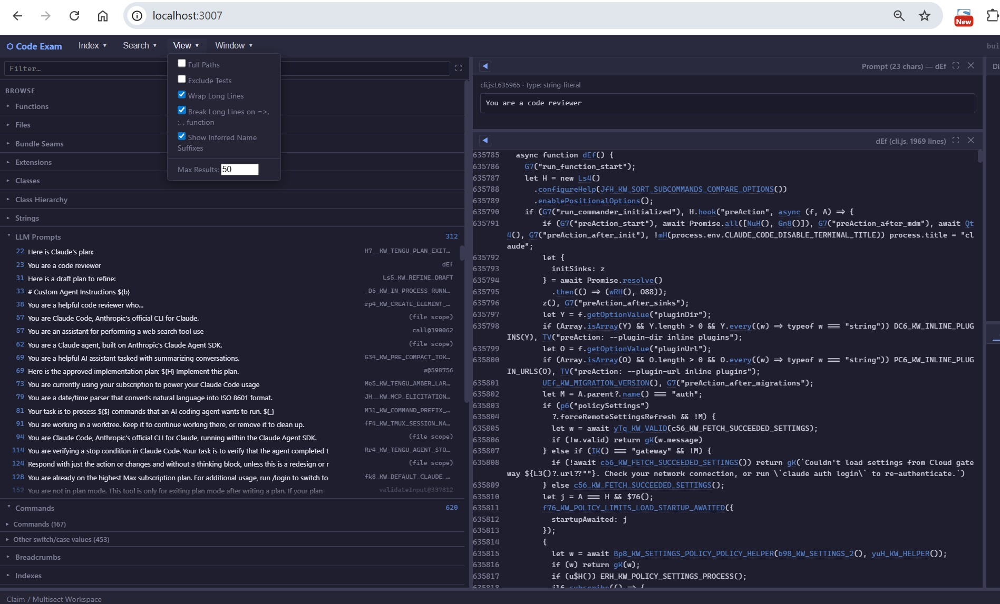

# CodeExam

CodeExam, as its name implies, is a tool for **examining code** — primarily
source code, and with a growing emphasis on **quasi-source**: recovering
indexable structure from artifacts that weren't shipped as source (minified
bundles, binary executable files, embedded scripts).

Use CodeExam to first build an index over a codebase, then browse, search,
and cross-reference (callers, callees, call trees, file/folder coupling) at
scale — across **C, C++, Java, JavaScript, TypeScript, Python, C#, Go, Rust,
PHP, and Ruby** (tree-sitter), with regex-level support for a dozen more
(e.g. Swift, Kotlin, Objective-C). If you've used a code-comprehension tool
like SciTools Understand, the basic browse and cross-reference features will
feel familiar. CodeExam goes beyond standard code navigation in important
ways, briefly described below and detailed in the individual doc pages linked
below.

CodeExam represents the principal author's **several decades of experience
as a source-code examiner in litigation, and in reverse-engineering
commercial software**. Many of its features grew out of tools written over
the years to index large source trees, to search those indexes in ways
off-the-shelf tools don't, and to extract and summarize information scattered
across a codebase — needs that recur on every examination and that
general-purpose editors and IDEs handle poorly. It was built initially for
source-code examination in patent and trade-secret litigation, but most of
what it does is general-purpose **code comprehension**, useful to anyone
facing a large, unfamiliar codebase they didn't write. Rather than code
maintenance or modification, CodeExam is generally for **scrutinizing code
as-is** — one alternate name for the product is **Scrutable**™.

The engine is **deterministic**: the same index and the same command produce
the same answer, with no AI model in the basic loop. An important but
**optional** set of **AI-based features** can summarize code, answer
questions, and draft analyses, but they only ever touch *output*, never the
index or the core results. They can run against a cloud model (Claude,
ChatGPT, or Gemini) or, for code that must not leave a protected machine, a
**local GGUF model, fully air-gapped**.

There are four ways to drive that one engine and one on-disk index format: a
**CLI**, its **interactive REPL** (read/eval/print loop), a **GUI**
(displayed in your default browser, but without internet; served on localhost
only), and an **MCP server** for AI clients. Build the index once; query it
from any of these four interfaces.

**CodeExam and AI:** CodeExam relates to AI in three distinct ways: (a) AI
was used to *build* CodeExam; (b) users can *optionally* use AI during an
examination; (c) CodeExam *detects* AI/ML in target code — which,
interestingly, requires no AI at run time: the AI skill and knowledge are
baked into mechanical detectors.



*Prompt catalog — LLM prompts recovered from the minified `cli.js` bundled inside `claude.exe`.*

## Six key features

1. **AI-assisted examination.** An optional set of AI-based features — a
   cloud model (Claude, ChatGPT, or Gemini), or a local GGUF model on your
   own GPU — together with CodeExam's MCP tools, to summarize code, answer
   questions, and draft analyses. AI-assisted examination may already be
   familiar (e.g. GitHub Copilot); CodeExam's emphasis is on running it over
   its own deterministic index, and on the local option.
   → [`AI_ASSISTED_CODE_EXAM.md`](docs/AI_ASSISTED_CODE_EXAM.md),
   [`LOCAL_LLM.md`](docs/LOCAL_LLM.md)

2. **Air-gapped operation.** CodeExam can run with all internet/cloud access
   blocked — for code that must not leave a protected machine. Even with all
   internet/cloud access blocked, you still have the option of using
   CodeExam's AI features by pointing it at a local AI (GGUF) model. Though
   optional and only one part of CodeExam, and while most users won't need
   it, nonetheless "local first" is a key underlying premise: we see local
   models and more capable GPU machines becoming steadily more important.
   → [`AIR_GAPPED.md`](docs/AIR_GAPPED.md), [`LOCAL_LLM.md`](docs/LOCAL_LLM.md)

3. **Uncovering what a codebase is about.** CodeExam works to extract a
   codebase's "vocabulary" and key concepts, its "breadcrumbs" (telemetry
   markers in code), and metrics — and presents initial questions to ask and
   good first places to look, via the Overview and (optional) AI Overview
   features. → [`UNCOVER_KEY_CODE.md`](docs/UNCOVER_KEY_CODE.md)

4. **Quasi-source.** A surprising amount of indexable structure can be
   recovered from artifacts never shipped as source — minified/bundled JS,
   binaries (strings + demangled C++ symbols), JavaScript embedded inside
   native executables — then searched and cross-referenced with the same
   machinery as real source. → [`QUASI_SOURCE.md`](docs/QUASI_SOURCE.md)

5. **Detecting AI/ML and infrastructure in target code.** A detector suite
   surfaces inferred AI/ML pipelines, the models a codebase defines and
   uses, LLM calls, tools, agents/chains, embeddings, prompts, and the
   operational stack (e.g. containers).
   → [`DETECTING_AI_ML.md`](docs/DETECTING_AI_ML.md)

6. **Structural (non-textual) code search.** Ways of finding and identifying
   code that don't depend on what the code *says*: structural
   duplicate detection and diff, transform-resilient function fingerprints
   ("funcstrings"), synonym expansion in Multisect search, and catalogs that
   link commands to their handlers by position in dispatch tables rather
   than by name. → [`STRUCTURAL_SEARCH.md`](docs/STRUCTURAL_SEARCH.md)

## What CodeExam is good at

- **Orienting fast in unfamiliar code** — vocabulary and Overview tell you
  what a codebase is about and where to look first, before you read a line.
  → [`UNCOVER_KEY_CODE.md`](docs/UNCOVER_KEY_CODE.md)
- **Helping to prove an absence** — corpus-wide *negative* search: helping
  show something is *not* present anywhere in the index, not just that it's
  missing from the file you happened to open.
  → [`CODEEXAM_SEARCHING.md`](docs/CODEEXAM_SEARCHING.md)
- **Examining what wasn't shipped as source** — quasi-source recovers
  structure from minified bundles and binaries.
  → [`QUASI_SOURCE.md`](docs/QUASI_SOURCE.md)
- **Seeing what the code points to but doesn't contain** —
  `--referenced-resources` surfaces the external surface: URLs and hosts, env
  vars, file paths, external commands, cloud config, and model IDs —
  including files the code references but that aren't in the index (config,
  data, keys, templates), with how often each is referenced.
  → [`CODEEXAM_BROWSING.md`](docs/CODEEXAM_BROWSING.md)
- **Working on technical prose, not just code** — searching and charting
  **patent claims** against a codebase, and (work in progress) generating
  **"pseudo-claims" from code**: claim-shaped descriptions of what the code
  does. → [`CODEEXAM_PATENT_CLAIMS.md`](docs/CODEEXAM_PATENT_CLAIMS.md)
- **Multisect search** — narrowing a multi-term search to the smallest scope
  in which all the terms co-occur, from file, to function, to the specific
  lines. → [`CODEEXAM_SEARCHING.md`](docs/CODEEXAM_SEARCHING.md)
- **Helping map the client/server boundary** — `--client-server` finds
  declared server routes and the client calls that consume them, reconciled
  by URL path, and flags client calls with **no matching server route** — the
  "missing server code" signal (e.g. a production that ships the client but
  withholds the server). It's a heuristic pass over the HTTP surface,
  strongest on common JS/Express-style shapes, not a full routing-graph
  analysis. → [`CODEEXAM_BROWSING.md`](docs/CODEEXAM_BROWSING.md)

## Quick start

CodeExam needs **[Node.js 18+](https://nodejs.org)** and a one-time
`npm install` from the project root:

```bash
npm install
```

**First time?** A fresh download bundles a small demo index, so a bare `ce`
shows a short welcome and `ce --gui` opens the GUI on the demo — no build
needed to look around. For the REPL, the MCP server, requirements, and
network-exposure cautions, see
[`GETTING_STARTED.md`](docs/GETTING_STARTED.md).

Build an index over a codebase — a directory, a zip/tar archive, a single
file, or an `@filelist` — and give the index a name with `--index-path`:

```bash
# Build an index named .mycode over a codebase
node src/index.js --build-index /path/to/codebase --index-path .mycode
```

Then query it — every command reads the index you name with `--index-path`:

```bash
# What is this codebase about? Its top domain-specific terms (TF-IDF)
node src/index.js --index-path .mycode --vocabulary 25

# One-shot orientation: size, languages, structure, entry points
node src/index.js --index-path .mycode --overview

# List functions, largest first
node src/index.js --index-path .mycode --functions --sort size

# List LLM prompts found in the code, with the associated code
node src/index.js --index-path .mycode --prompt-catalog
```

The repo ships shims — **`ce`** (POSIX) / **`ce.bat`** (Windows) — so `ce
--index-path .mycode --overview` is shorthand for `node src/index.js
--index-path .mycode --overview`.

To open the same index in the **GUI**, add `--gui`:

```bash
ce --gui --index-path .mycode
```

It prints a localhost URL to open in your browser (e.g.
`http://127.0.0.1:3000/`).

**Some current limits.** Output from many commands is capped by default, to
simplify output especially in the GUI, so absence in a result can mean "past
the limit," not "not there" — raise `--max-results` when it matters (#137).
Language coverage is deep for the tree-sitter languages and shallower
(regex-level) for the rest, so parse gaps are possible — C++ class
recognition in particular is incomplete. And CodeExam works from an index
*snapshot*: it reflects the code as it stood when the index was built, so
rebuild the index to pick up later changes. For a more thorough list, see
[`CODEEXAM_KNOWN_LIMITATIONS.md`](docs/CODEEXAM_KNOWN_LIMITATIONS.md).

## Documentation

| Doc | What's in it |
|---|---|
| [`GETTING_STARTED.md`](docs/GETTING_STARTED.md) | Install, requirements, and the ways to run CodeExam (CLI, REPL, GUI, MCP) |
| [`CODEEXAM_CLI.md`](docs/CODEEXAM_CLI.md) | CLI overview (see also [`docs/cli.md`](docs/cli.md), the per-flag reference) |
| [`CODEEXAM_GUI.md`](docs/CODEEXAM_GUI.md) | GUI layout — panes, accordions, Workspace |
| [`CODEEXAM_MCP.md`](docs/CODEEXAM_MCP.md) | The MCP tool surface as an LLM client sees it |
| [`CODEEXAM_NOTATION.md`](docs/CODEEXAM_NOTATION.md) | Symbols & notation shared by the CLI and GUI |
| [`CODEEXAM_KEY_FEATURES.md`](docs/CODEEXAM_KEY_FEATURES.md) | Browse and search, metrics, catalogs — the overview |
| [`CODEEXAM_SEARCHING.md`](docs/CODEEXAM_SEARCHING.md) | Literal / fast / regex search and multisect |
| [`CODEEXAM_BROWSING.md`](docs/CODEEXAM_BROWSING.md) | Structural lists, cross-reference, and code-surfacing metrics |
| [`UNCOVER_KEY_CODE.md`](docs/UNCOVER_KEY_CODE.md) | Vocabulary, breadcrumbs, Overview / AI Overview |
| [`QUASI_SOURCE.md`](docs/QUASI_SOURCE.md) | Binary analysis and bundled-JS extraction |
| [`DETECTING_AI_ML.md`](docs/DETECTING_AI_ML.md) | The AI/ML, LLM-app, and infrastructure detector suite |
| [`STRUCTURAL_SEARCH.md`](docs/STRUCTURAL_SEARCH.md) | Non-textual search: fingerprints, structural dupes, deobfuscation |
| [`AI_ASSISTED_CODE_EXAM.md`](docs/AI_ASSISTED_CODE_EXAM.md) | Optional LLM assistance (`--analyze`, claim search, input masking) |
| [`CODEEXAM_PATENT_CLAIMS.md`](docs/CODEEXAM_PATENT_CLAIMS.md) | Searching and charting patent claims against a codebase |
| [`LOCAL_LLM.md`](docs/LOCAL_LLM.md) | Local GGUF models |
| [`AIR_GAPPED.md`](docs/AIR_GAPPED.md) | Enforced no-cloud operation |
| [`REPRODUCIBILITY.md`](docs/REPRODUCIBILITY.md) | Reproducibility of AI-layer answers; pinning the model side (`--reproducible`) |
| [`CODEEXAM_INDEXES.md`](docs/CODEEXAM_INDEXES.md) | Building and managing indexes; the on-disk format |
| [`CODEEXAM_ARCHITECTURE.md`](docs/CODEEXAM_ARCHITECTURE.md) | Engine and module layout |
| [`CODEEXAM_TESTING.md`](docs/CODEEXAM_TESTING.md) | The test suite |
| [`CODEEXAM_KNOWN_LIMITATIONS.md`](docs/CODEEXAM_KNOWN_LIMITATIONS.md) | Current gaps and limitations |
| [`CODEEXAM_CODECLAIM.md`](docs/CODEEXAM_CODECLAIM.md) | CodeExam's relation to patent analysis, and the CodeClaim vision |

## API costs

CodeExam itself has no cost to run — only its **optional** cloud-AI features
do, and only when you use them. Those features call a paid API (Anthropic,
OpenAI, or Google); per request the amounts are small — a whole-codebase AI
Overview typically runs around $0.50, analyzing a single function a few
cents — and CodeExam shows an estimated cost before it spends. Two guards keep
it bounded:

- **`--max-budget-usd`** — a hard spend ceiling on an AI Overview run (also
  settable via the `CE_OVERVIEW_MAX_BUDGET` environment variable; default $5).
- **`CE_CLAIMS_COST_GUARD`** — an estimated-cost threshold for the
  claim/analyze pipeline: if a run's projected cost exceeds it, CodeExam stops
  and asks before sending anything (raise the value, or pass `--force`, to
  proceed).

Running a **local GGUF model has no API cost at all** — another argument for
the local path.

## Related: CodeClaim

A patent-focused build, tailored for IP-litigation workflows, is being
developed using the name **CodeClaim**; it shares the CodeExam engine, and
CodeExam itself already carries some initial claim-analysis machinery. See
[`CODEEXAM_CODECLAIM.md`](docs/CODEEXAM_CODECLAIM.md).

---

*CodeExam is roughly 77,000 lines of JavaScript (over 100,000 counting the
test suite and dev scripts) running under Node.js, nearly all written by
Claude Code in close collaboration with the main author, in several places
building on his earlier tooling. [[placeholder for URLs to ndx/find C++ and
awk code; Opstrings code; term-ranking code; etc.]] CodeExam and CodeClaim
are developed by Andrew Schulman — see
[softwarelitigationconsulting.com](https://www.softwarelitigationconsulting.com/).*

*Examples of how different CodeExam features evolved from an initial "vibe"
request to current code will be added later. For now, some early work with
Claude can be seen for the
[Python prototype](https://claude.ai/share/f601d9be-5e3c-4353-a643-2d148bb83a16)
and the
[initial Python-to-Node.js port](https://claude.ai/share/e86c26cf-69d4-454a-94b9-bc9aed7bf523).*

*This documentation was drafted by Claude Code, with substantial editing
("punch lists") by Schulman.*
